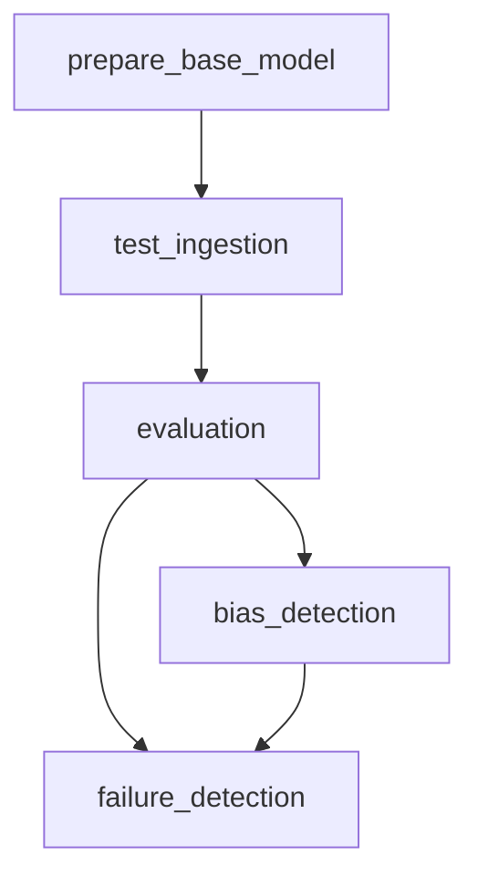

# Machine Learning Pipelines

## Overview

This repository contains the implementation of a LangGraph-based workflow for building and evaluating chatbot functionalities. The workflow consists of multiple stages, each corresponding to a specific step in preparing, ingesting, evaluating, and detecting bias in chatbot responses. The modular design enables scalability, experimentation, and easy integration with other systems.

---

## Workflow Overview

The workflow follows a sequential pipeline to ensure smooth execution across stages. Below is a graphical representation of the pipeline:



---

## Pipeline Stages

### 1. **Prepare Base Model**
- **File:** `stage_01_prepare_base_model.py`
- **Purpose:**  
  Initializes the LangGraph workflow by creating the state graph for chatbot responses.
- **Key Features:**
  - Configures the base model using LangGraph.
  - Integrates environment variables for secure API key access.
- **Execution Command:**
  ```bash
  python src/pipeline/stage_01_prepare_base_model.py
  ```

---

### 2. **Test Data Ingestion**
- **File:** `stage_02_test_data_ingestion.py`
- **Purpose:**  
  Fetches product data (metadata and reviews), generates synthetic test cases, and saves them in Parquet format for evaluation.
- **Key Features:**
  - Connects to PostgreSQL database using secure credentials.
  - Summarizes metadata using LLMs.
  - Creates RAGAS test datasets with varied difficulty levels.
- **Execution Command:**
  ```bash
  python src/pipeline/stage_02_test_data_ingestion.py
  ```

---

### 3. **Model Evaluation**
- **File:** `stage_03_model_evaluation.py`
- **Purpose:**  
  Evaluates chatbot responses using user reviews, metadata, and synthetic datasets.
- **Key Features:**
  - Generates responses using the chatbot's state graph.
  - Evaluates responses using metrics such as context precision, relevancy, and faithfulness.
  - Logs evaluation results in MLFlow for traceability.
- **Execution Command:**
  ```bash
  python src/pipeline/stage_03_model_evaluation.py
  ```

---

### 4. **Bias Detection**
- **File:** `stage_04_bias_detection.py`
- **Purpose:**  
  Identifies and mitigates potential biases in chatbot responses.
- **Key Features:**
  - Measures bias across response patterns.
  - Stores bias-related metrics for analysis.
- **Execution Command:**
  ```bash
  python src/pipeline/stage_04_bias_detection.py
  ```

---

### 5. **Failure Detection**
- **File:** `stage_05_failure_detection.py`
- **Purpose:**  
  Detects and handles failures in the chatbot pipeline by sending notifications in teams channel, ensuring robustness and reliability.
- **Key Features:**
  - Logs errors and exceptions.
  - Sends message to teams channel
- **Execution Command:**
  ```bash
  python src/pipeline/stage_05_failure_detection.py
  ```

---

## Directory Structure

```
src/
├── components/                # Nodes, States, and agents for langgraph workflow.
├── config/                     # Configuration file setup for the pipelines.
├── constants/                 # Constant variables for pipeline configuration.
├── entity/                    # Data models for pipeline entities.
├── main/                      # Core modules for executing LangGraph workflows.
├── pipeline/                  # Pipeline scripts for all stages.
│   ├── stage_01_prepare_base_model.py
│   ├── stage_02_test_data_ingestion.py
│   ├── stage_03_model_evaluation.py
│   ├── stage_04_bias_detection.py
│   ├── stage_05_failure_detection.py
├── utils/                     # Utility scripts (e.g., database connections).
├── app.py                     # Main application script for Streamlit interface.
├── serve.py                   # FastAPI application for API based communication.
```

---

## Key Configurations

### Environment Variables
Add the following to your `.env` file:
```
HF_TOKEN=<your-huggingface-token>
OPENAI_API_KEY=<your-openai-api-key>
GROQ_API_KEY=<your-groq-api-key>
LANGFUSE_PUBLIC_KEY=<your-langfuse-public-key>
LANGFUSE_SECRET_KEY=<your-langfuse-secret-key>
INSTANCE_CONNECTION_NAME=<your-instance-connection-name>
DB_USER=<your-db-user>
DB_PASS=<your-db-password>
DB_NAME=<your-db-name>
```

### Configuration Files
- `config/config.yaml`: Defines paths and parameters for the pipelines.
- `config/prompts.yaml`: Stores the prompts used by the LLM for metadata summarization.

---

## Troubleshooting

- **Database Connection Errors:**  
  Verify that environment variables for database credentials are correctly set.

- **Missing Data:**  
  Ensure required files (e.g., Parquet files) are present in the `evaluation/testset/` directory.

- **MLFlow Issues:**  
  Check the `mlflow_uri` configuration in `config.yaml`.

---
