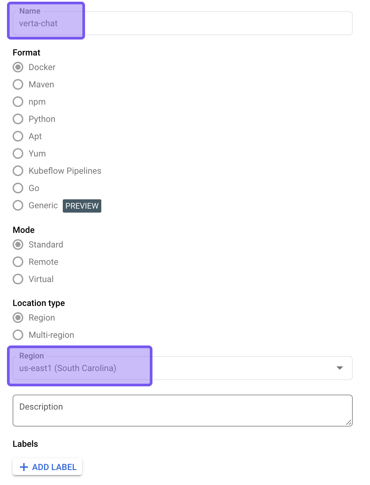

# Verta-Chatbot Project Setup

This guide provides step-by-step instructions on setting up Verta-chatbot project on Google Cloud Platform.

## Installation and Setup
### Prerequisites

Uses python for package management.

- Python ^3.12
- Required Python packagesRequired Python packages (listed in pyproject.toml)
- Poetry Package Manager installed (`pip install poetry`)

### Steps

#### 1. **Clone the Repository:**
```bash
git clone https://github.com/eCom-dev5/eCom-Chatbot/tree/dev
cd eCom-Chatbot
```

#### 2. **Install Dependencies:**
You should first install python to create and activate a virtual environment with dependencies. Then run:
```bash
poetry config virtualenvs.in-project true 
poetry install
```

#### 3. **Storing API keys and other secret keys**
To securely store your API keys and other sensitive information, you should create a `.env` file. 
Follow these steps:

1. In the root directory of your project, create a new file named `.env`:
    ```bash
    touch .env
    ```
2. Open the `.env` file in your favorite text editor and add your API keys in the following format:
    ```bash
    API_KEY=<your-api-key-here>
    ```
Make sure: `HOST` is set to "0.0.0.0" and `PORT` is set to 80. Generate a unique uuid token for `VERTA_API_ACCESS_TOKEN` or assign it any string value.

Cover the following in your .env file: 
```
- `OPENAI_API_KEY`
- `HF_TOKEN`
- `GROQ_API_KEY`
- `LANGFUSE_SECRET_KEY`
- `LANGFUSE_PUBLIC_KEY`
- `LANGFUSE_HOST`
- `DB_USER`
- `DB_PASS`
- `DB_NAME`
- `INSTANCE_CONNECTION_NAME`
- `GOOGLE_APPLICATION_CREDENTIALS`
- `MLFLOW_TRACKING_URI`
- `MLFLOW_TRACKING_USERNAME`
- `MLFLOW_TRACKING_PASSWORD`
- `VERTA_API_ACCESS_TOKEN`
- `HOST`
- `PORT`
- `MS_TEAMS_WEBHOOK_URL`
```

#### 5. **Generating a GCP JSON Connection File**
To generate a JSON connection file for Google Cloud Platform (GCP), follow these steps:
1. Access Credentials:
    - Navigate to Credentials in the Google Cloud Console.
2. Create a Service Account:
    - Click on Create Credentials and select Service Account.
3. Assign a Role:
    - Choose the Owner role for the Service Account, then click Done.
    - Along with Owner, set Artifact Registry Writer, Cloud Run Admin, Cloud Run Invoker, Cloud SQL Instance User, Logs Writer, Service Account User, Storage Object Viewer roles too
4. Generate JSON Key:
    - Locate your newly created Service Account.
    - Click on Keys.
    - Select Add Key, then choose JSON.
    - Save the generated JSON file securely.
5. Store the JSON File:
    - Place the JSON file in the main directory of your project.
6. Save the file name as `verta-gcp.json` and set `GOOGLE_APPLICATION_CREDENTIALS` in `.env` as `./verta-gcp.json`

#### 6. Run the Data Pipelines
To set up the database instance on GCP Cloud Run, navigate to the `data_pipeline` directory using
```bash
cd data_pipeline
```
and follow the instructions provided in the [readme.md](https://github.com/eCom-dev5/eCom-Chatbot/blob/dev/Data_Pipeline/README.md) file.

#### 7. **Connect Dagshub to the Repository**  
To log the experiments to MLFlow and track them using Dagshub, follow these steps:  

- Create a Dagshub account using the GitHub account associated with your repository.  
- Create a new repository on Dagshub and connect it to your GitHub repository.  
- Navigate to the **Remote -> Experiments** tab and copy the MLflow Tracking Remote URI.  
- Go to **Settings -> Tokens** in Dagshub and create a new token.  
- Add the following variables to your `.env` file:  
    - `MLFLOW_TRACKING_URI` (paste the tracking URI here)  
    - `MLFLOW_TRACKING_USERNAME` (use the Github Username)
    - `MLFLOW_TRACKING_PASSWORD` (use the generated token here)  
- Open `src/config/configuration.py`, go to line 79, and set the `MLFLOW_TRACKING_URI` variable with the copied tracking URI.  


#### 8. **Run the Pipelines**  

To run the pipelines, execute the following command:  
```bash
dvc repro
```

This will run the entire 5-stage pipeline for the chatbot. Please note the following:  
- **Test Data Ingestion**: This step takes approximately **1.5 hours** to complete. However, the test data ingestion is already present, so you can skip this step if desired.  
- Ensure you have sufficient **credits** in your OpenAI API account as this process can be resource-intensive.  
- **Model Evaluation** and **Bias Detection** steps each take around **30 minutes** to complete.  

If you want to run **custom stages** of the pipeline:  
1. Comment out the relevant code for the stages you wish to skip in `src/main.py`.  
2. Run the pipeline using:  
```bash
poetry run src/main.py
```  
This allows you to focus on specific pipeline stages without running the entire workflow.

#### 9. **Run Unit Tests**  

To ensure that each module of the code is working properly, run the unit tests using the following command:  
```bash
poetry run pytest tests/test.py -v
```  

This will execute a total of **14 tests**. Ensure that all tests pass successfully before proceeding to the next step in the development or deployment process.

#### 10. **Local API Deployment**

To host the FASTAPI-wrapped API locally, run the following command:  
```bash
poetry run python src/serve.py
```  

You can read the [API_README.md](https://github.com/eCom-dev5/eCom-Chatbot/blob/dev/readme/API_README.md) file (located in the same folder) for details about the different endpoints the app exposes. To test the endpoints, visit `https://0.0.0.0:80/docs` in your browser, or use Postman to make requests to the API.


#### 11. **Optional: Run Streamlit Webpage Version of the App**

To check the working of the app locally as a UI, run the following command:  
```bash
poetry run streamlit src/app.py
```  

This will launch a Streamlit interface that allows you to interact with the app through a graphical user interface.

#### 12. **Set up GCP for Deployment**

1. **Create Docker Artifact in Artifact Registry**  
   - Go to **Artifact Registry** in the Google Cloud Console.
   - Create a new **Docker Artifact** and name the registry as `verta-chat`.
   - Select the region as `us-east1`.
   - Ensure that the **SQL Admin API** and **Artifact Registry API** are enabled in your Google Cloud project.

   

2. **Set Secrets in GitHub Repository**  
   - Navigate to your repository on **GitHub**.
   - Select **Settings** and then go to **Secrets and Variables** in the left pane. Click on **Actions**.
   - In the **Secrets** tab, set up the following secrets:
     - **GAR_LOCATION**: `us-east1` (same region as the Artifact Registry).
     - **GAR_NAME**: `verta-chat` (name of the Artifact Registry).
     - **GCP_SA_KEY**: Copy and paste the content of your `verta-gcp.json` (service account JSON key) into this secret.
     - **PROJECT_ID**: In the Google Cloud Console, click on the top-left project name, and copy the **Project ID**.
     - **REGION**: `us-east1` (same as the Artifact Registry).
     - **SERVICE**: `verta-chat-service` (or choose a unique service name for Cloud Run).

    

3. **Set Environment Variables in GitHub Repository**  
   - Go to the **Variables** tab in the **Secrets and Variables** section of GitHub.
   - Apart from the `GOOGLE_APPLICATION_CREDENTIALS`, set the environment variables and their values from the `.env` file to their corresponding variables in GitHub.

   

#### 13. **Run Git Actions**

1. **Ensure Main Branch is 'dev'**  
   - Make sure that your main branch is named **`dev`** and is up-to-date with all the previous steps.

2. **Create 'staging' Branch (First Time Setup)**  
   - If this is the first time, create a new branch from **`dev`** and name it **`staging`**.
   - In the **Actions** tab on **GitHub**, you will see that the **staging** workflow will run (this involves both CI and CD processes).
   - This step runs unit tests, the model pipeline, builds the Dockerfile, and pushes it to the Artifact Registry (as described in previous steps).

3. **Deploy to Production**  
   - Once the **staging** branch workflow is completed successfully, create a new branch from **staging** and name it **`production`**.
   - In the **Actions** tab, the **production** workflow will run, which pulls the latest Docker image from the Artifact Registry and deploys it to **Cloud Run**.

4. **If Staging and Production Branches Already Exist**  
   - First, push your code to **`dev`**.
   - Create a **Pull Request** from **`dev`** to **`staging`**.
   - Wait for the **staging** Git actions to complete before proceeding.
   - Once the **staging** actions are successful, create another **Pull Request** from **`staging`** to **`production`** to trigger the production deployment.
   
5. **Important Notes for Branches**  
   - Ensure that you follow the order:
     1. Push code to **`dev`**.
     2. Make a Pull Request from **`dev`** to **`staging`**.
     3. Once **staging** actions are complete, then create a Pull Request from **`staging`** to **`production`**.
   - Do **NOT** push any changes to **`staging`** after pushing from **`dev`**. The **`dev`** and **`staging`** branches must be synchronized and on the same level before staging actions can work. Similarly, **`staging`** and **`production`** must also be on the same level before the production deployment actions run.
