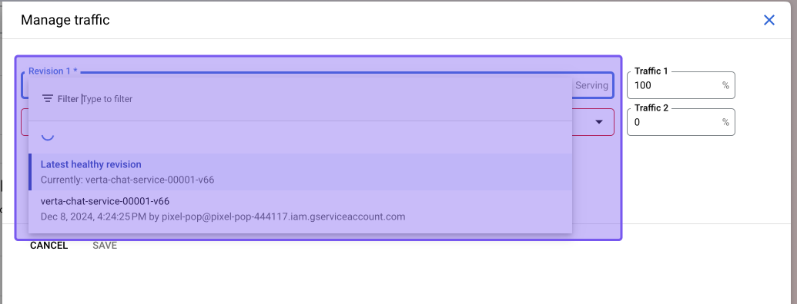

# **Verta-Chatbot Model Rollback Documentation**

## **Overview**

The **Verta-Chatbot** is a scalable, cloud-native solution integrating robust pipelines for model evaluation and deployment. The system employs **Google Cloud Run** for serverless application hosting and **Google Artifact Registry** for containerized artifact storage. A core feature of the system is the **rollback process** in Cloud Run, which ensures stability by allowing quick reversion to previous stable deployments in case of errors. Additionally, evaluation pipelines validate model performance, while failure detection ensures reliable operation.

---

## **Cloud Run Rollback Process**

### **How Rollback Works in Cloud Run**

In **Google Cloud Run**, every deployment creates a new **revision**, which is a snapshot of the service at that point. If a new deployment introduces bugs or errors, rollback allows redirecting all traffic to a previously stable revision. This ensures service continuity with minimal downtime.

Key features of the rollback process:
- **Revision History**: Each deployment revision is retained, with unique identifiers and metadata.
- **Traffic Management**: Traffic can be redirected to any previous revision.
- **No Downtime Rollback**: Cloud Run enables instant rollback without needing to rebuild or redeploy.

### **Detailed Steps for Rollback**

1. **Access Cloud Run Console**:
   - Open **Google Cloud Console**.
   - Navigate to **Cloud Run** and select your service (e.g., `verta-chat-service`).

2. **View Revisions**:
   - Click on the **"Revisions"** tab to see the history of deployments.
   - Each revision is listed with details such as timestamp, deployment ID, and current traffic percentage.

3. **Select a Stable Revision**:
   - Identify the last stable revision (e.g., `verta-chat-service-00012`).

4. **Manage Traffic**:
   - Click **"Manage Traffic"**.
   - Set the desired revision to handle **100% of traffic**.
   - Save the changes.

   

5. **Validation**:
   - Confirm rollback by testing the application endpoints.
   - Monitor logs in the Cloud Run dashboard to ensure proper functionality.

6. **Monitor and Adjust**:
   - Use the **Logs** and **Metrics** tabs in Cloud Run to monitor post-rollback performance.

### **Best Practices for Rollback**

1. **Use Descriptive Revision Tags**:
   - Tag revisions with meaningful names for easier identification.

2. **Test Before Rollback**:
   - Use the **split traffic** feature to test a revision with a small percentage of traffic before a full rollback.

3. **Automate Rollbacks**:
   - Integrate rollback triggers in your CI/CD pipeline for automated recovery during failure detection.

